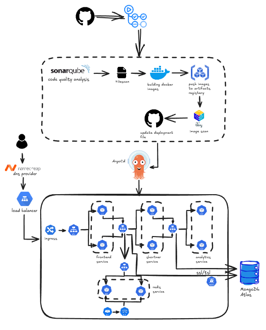

# 🏷️ URL Shortener Project

Welcome to the **URL Shortener** project! This project allows users to shorten long URLs, track analytics, and provide a seamless redirection service. The application is deployed on **Google Kubernetes Engine (GKE)** with a custom domain, secure **SSL/TLS certificates**, and follows best DevOps practices for CI/CD, security, and scalability.

---

## 📑 Features

- **URL Shortening**: Quickly shorten long URLs to share with ease.
- **Analytics**: Track URL usage (e.g., clicks, geolocation).
- **Custom Domain**: Serve your URL shortener under a custom domain.
- **Secure**: End-to-end SSL/TLS encryption for all traffic.
- **Scalable Deployment**: Deployed on GKE using microservices architecture.
- **CI/CD Pipeline**: Automated testing, image builds, and deployment.
- **Code Quality**: Integrated with SonarQube for static analysis.
- **Image Scanning**: Scanning Docker images for vulnerabilities with Trivy.
- **Monitoring**: Robust logging and monitoring with cloud tools.

---

## 🛠️ Tech Stack

### **Backend Services**

- **Node.js**: Backend for URL shortening and analytics services.
- **MongoDB Atlas**: Cloud-managed NoSQL database for storing short URLs.
- **Redis**: Caching layer for fast redirection.

### **Frontend Services**

- **Next.js**: Modern user interface for shortening and managing URLs.

### **Cloud Infrastructure**

- **Google Kubernetes Engine (GKE)**: Cluster for microservices deployment.
- **Ingress Controller**: Handles traffic routing and SSL termination.
- **Load Balancer**: Efficiently distributes traffic across services.
- **Cloud DNS**: Custom domain DNS resolution.

### **CI/CD Pipeline**

- **GitHub Actions**: Automates build, test, and deployment processes.
- **SonarQube**: Ensures code quality with linting and static analysis.
- **Docker & Trivy**: Builds container images and performs vulnerability scanning.
- **ArgoCD**: GitOps-based deployment tool for Kubernetes.

---

## 📂 Architecture Overview

### **Flow**

1. Code is pushed to **GitHub**.
2. **GitHub Actions** triggers:
   - Code quality analysis via **SonarQube**.
   - Docker image build and push to the artifact registry.
   - **Trivy** scans Docker images for vulnerabilities.
   - Deployment files are updated in GitHub.
3. **ArgoCD** pulls deployment manifests and updates the GKE cluster.
4. Traffic flows via:
   - **Custom domain (Namecheap)** with DNS resolution.
   - Load Balancer and Ingress controller.
   - SSL/TLS encryption terminates traffic securely.
5. Microservices are hosted in **GKE**:
   - **Frontend Service**: UI for users.
   - **Shortener Service**: Handles URL creation and redirection.
   - **Analytics Service**: Tracks and reports URL metrics.
6. Data is stored securely in:
   - **MongoDB Atlas** for persistent storage.
   - **Redis** for fast redirection caching.

---

## Key Highlights

- **Scalability**: Services scale independently within Kubernetes pods.
- **Security**: Image vulnerability scanning, SSL/TLS encryption, and secure MongoDB access.
- **Automation**: Streamlined CI/CD pipeline with GitOps approach using ArgoCD.
- **Monitoring**: Logs and metrics available for better observability.

---

## 🚀 Live Demo

- **Base URL**: `https://shrtnn.xyz`
- Shorten and manage your links via the intuitive UI.

---

## 📈 Analytics

The **analytics service** provides:

- Total clicks per URL.
- User location and browser details.

---

## 🤝 Contributing

Contributions are welcome! Feel free to fork this repository and submit a pull request.
